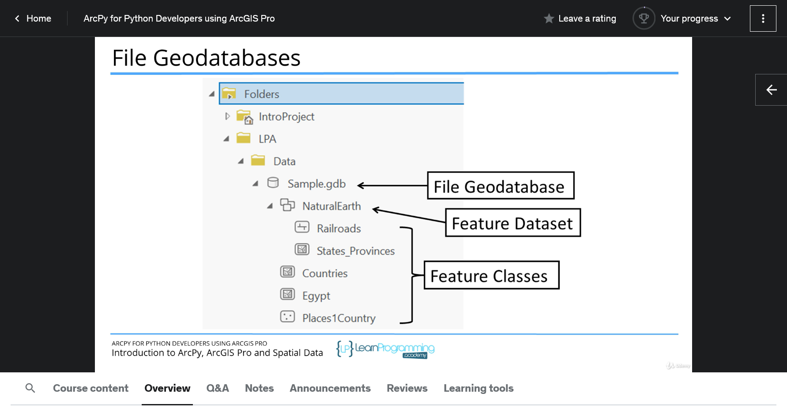

## About The Project

- ArcPy for Python Developers using ArcGIS Pro
- GIS is hot - take your python skills to new levels and greatly increase your career options.
- Tim Buchalka

&nbsp;

---

&nbsp;

## Introduction

- **ArcGIS Desktop**
  1. ArcGIS Pro (Requires Python 3)
  2. ArcMap
- **[All Documentation](https://doc.arcgis.com/en/)**
- **ArcGIS Arcpy**
  - **[Functions](https://pro.arcgis.com/en/pro-app/latest/arcpy/functions/alphabetical-list-of-arcpy-functions.htm)**
  - **[Classes](https://pro.arcgis.com/en/pro-app/latest/arcpy/classes/alphabetical-list-of-arcpy-classes.htm)**
  - **Modules**
    1. Charts module (arcpy.charts)
    2. Data Access module (arcpy.da)
    3. Geocoding module (arcpy.geocoding)
    4. Image Analysis module (arcpy.ia)
    5. Mapping module (arcpy.mp)
    6. Metadata module (arcpy.metadata)
    7. Network Analyst modules (arcpy.nax and arcpy.na)
    8. Sharing module (arcpy.sharing)
    9. Spatial Analyst module (arcpy.sa)
    10. Workflow Manager (Classic) module (arcpy.wmx)
  - **[Tools](https://pro.arcgis.com/en/pro-app/latest/tool-reference/introduction-anatomy/anatomy-of-a-tool-reference-page.htm)**
    1. arcpy.ddd
    2. arcpy.conversion
    3. arcpy.management
    4. [Data Comparison toolset](https://pro.arcgis.com/en/pro-app/latest/tool-reference/data-management/an-overview-of-the-data-comparison-toolset.htm)

&nbsp;

- Shapefile
  - [Natural Earth](https://www.naturalearthdata.com/)
- Layer
- Attribute Table

&nbsp;

- **ArcGIS Pro**
  - Analysis Tab -> Python -> Python window/ Python Notebook
  - Analysis Tab -> ModelBuilder
- Python IDLE

&nbsp;

---

&nbsp;
