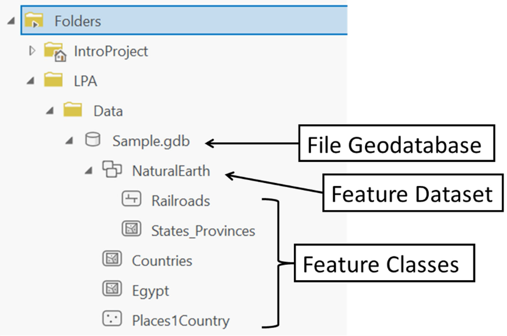

## About The Project

- ArcPy for Python Developers using ArcGIS Pro
- GIS is hot - take your python skills to new levels and greatly increase your career options.
- Tim Buchalka

&nbsp;

---

&nbsp;

## Introduction

- **ArcGIS Desktop**
  1. ArcGIS Pro (Requires Python 3)
  2. ArcMap
- **[All Documentation](https://doc.arcgis.com/en/)**
- **ArcGIS Arcpy**
  - **[Functions](https://pro.arcgis.com/en/pro-app/latest/arcpy/functions/alphabetical-list-of-arcpy-functions.htm)**
  - **[Classes](https://pro.arcgis.com/en/pro-app/latest/arcpy/classes/alphabetical-list-of-arcpy-classes.htm)**
  - **Modules**
    1. Charts module (arcpy.charts)
    2. Data Access module (arcpy.da)
    3. Geocoding module (arcpy.geocoding)
    4. Image Analysis module (arcpy.ia)
    5. Mapping module (arcpy.mp)
    6. Metadata module (arcpy.metadata)
    7. Network Analyst modules (arcpy.nax and arcpy.na)
    8. Sharing module (arcpy.sharing)
    9. Spatial Analyst module (arcpy.sa)
    10. Workflow Manager (Classic) module (arcpy.wmx)
  - **[Tools](https://pro.arcgis.com/en/pro-app/latest/tool-reference/introduction-anatomy/anatomy-of-a-tool-reference-page.htm)**
    1. arcpy.ddd
    2. arcpy.conversion
    3. arcpy.management
    4. [Data Comparison toolset](https://pro.arcgis.com/en/pro-app/latest/tool-reference/data-management/an-overview-of-the-data-comparison-toolset.htm)

&nbsp;

- Shapefile
  - [Natural Earth](https://www.naturalearthdata.com/)
- Layer
- Attribute Table
- Labeling Properties...
- `.tbx` vs `.pyt`
  - The main difference between a `.tbx` file and a `.pyt` file in ArcGIS is that a `.tbx` file is a standard toolbox that can contain geoprocessing tools written in a variety of programming languages (including Python), while a `.pyt` file is a custom Python toolbox that contains only Python script tools
  - Here are some more details about each type of toolbox:
    - `.tbx` file: A `.tbx` file is a standard toolbox file that can contain any type of geoprocessing tool, including tools written in Python, VBScript, JScript, or .NET. A `.tbx` file is created using ArcGIS Desktop or ArcGIS Pro and can be shared with others by copying it to a shared network location or sending it as an email attachment. The tools in a `.tbx` file can be accessed and used in ArcGIS Desktop or ArcGIS Pro.
    - `.pyt` file: A `.pyt` file is a custom Python toolbox that contains only Python script tools. A `.pyt` file is created using Python scripting in ArcGIS and provides greater flexibility and customization options than a standard `.tbx` file. Python script tools can be used to automate complex geoprocessing workflows or perform custom analysis tasks that are not available in the standard ArcGIS tools. A `.pyt` file can be shared with others by copying it to a shared network location or by including it in an ArcGIS add-in.
  - In general, a `.tbx` file is easier to create and can contain a wider range of geoprocessing tools, while a `.pyt` file requires more advanced Python programming skills but provides greater flexibility and customization options. The choice between a `.tbx` file and a `.pyt` file will depend on the specific needs and requirements of your project.

&nbsp;

- **ArcGIS Pro**
  - Analysis Tab -> Python -> Python window/ Python Notebook
  - Analysis Tab -> ModelBuilder
  - Analysis Tab -> Tools -> Geoprocessing
- Python IDLE

&nbsp;

---

&nbsp;
